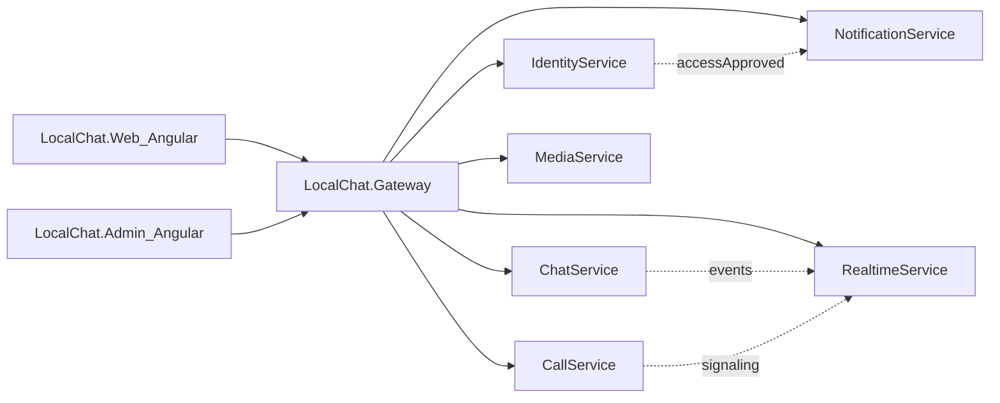
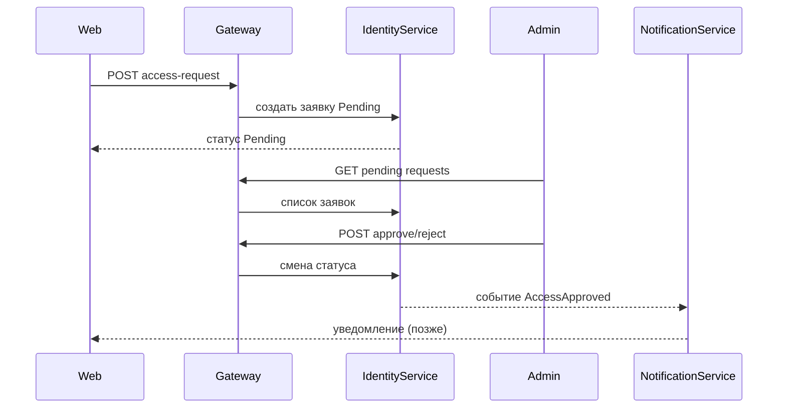
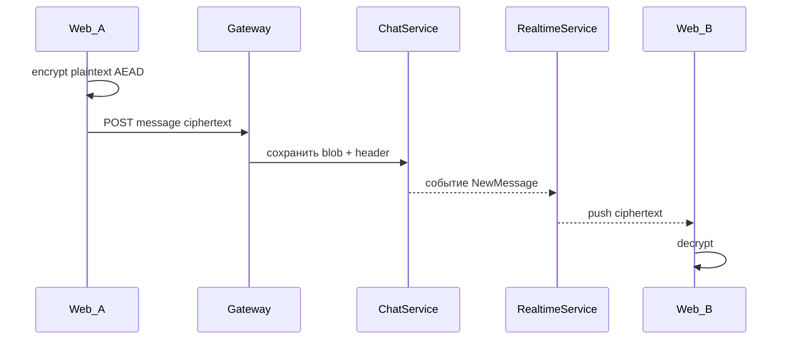

# Архитектура LocalChat

## Цель продукта

Закрытый мессенджер с:

- заявкой на доступ и подтверждением в админке;
- end-to-end шифрованием сообщений на клиенте;
- заделом под групповые чаты, медиа (фото/видео) и звонки (1:1 и групповые).

## Ключевые правила

1. **Сервер — relay + метаданные.** Plaintext и приватные ключи живут только на клиенте.
2. **E2EE:** Signal-like подход — X25519 (+ позже PQ hybrid), HKDF, ChaCha20-Poly1305 / AES-GCM, ratchet.
3. **Conversation** сразу моделируется как `Direct | Group` (UI групп — позже).
4. **Медиа** не хранятся в Chat: сообщение содержит `mediaRefs[]`.
5. **Звонки** — отдельный CallService (signaling; SFU позже), не смешиваются с доменной моделью текста.
6. **Админка** — отдельное Angular-приложение и admin-контур прав в Identity.

## Компоненты

## Поток: заявка на доступ

Только пользователи со статусом `Approved` получают рабочий JWT и доступ к чату.

## Поток: сообщение 1:1 (E2EE)

Сервер видит ciphertext, nonce, публичные ratchet/header поля, `conversationId`, `senderDeviceId` — не текст.

## Будущее: медиа

1. Клиент шифрует файл локально.
2. `MediaService` принимает encrypted blob, возвращает `mediaId`.
3. `ChatService` сохраняет сообщение с `mediaRefs: [mediaId]`.
4. Получатель скачивает blob и расшифровывает клиентским ключом.

## Будущее: звонки

1. `CallService` создаёт сессию и обменивает SDP/ICE (signaling).
2. Медиапоток — WebRTC peer-to-peer (1:1) или через SFU (группы).
3. События «звонок начат/завершён» могут отражаться в Chat как системные ciphertext/events, без RTP в ChatService.

## Приоритеты реализации

| Фаза | Состав |
|---|---|
| **P0 MVP** | Orchestrator, Gateway, Identity, Chat, Realtime, Migration, Web, Admin |
| **P1** | Media, Notification |
| **P2** | Call, UI групп, SFU |

Подробные чеклисты — в `docs/todo.md` каждого сервиса.
